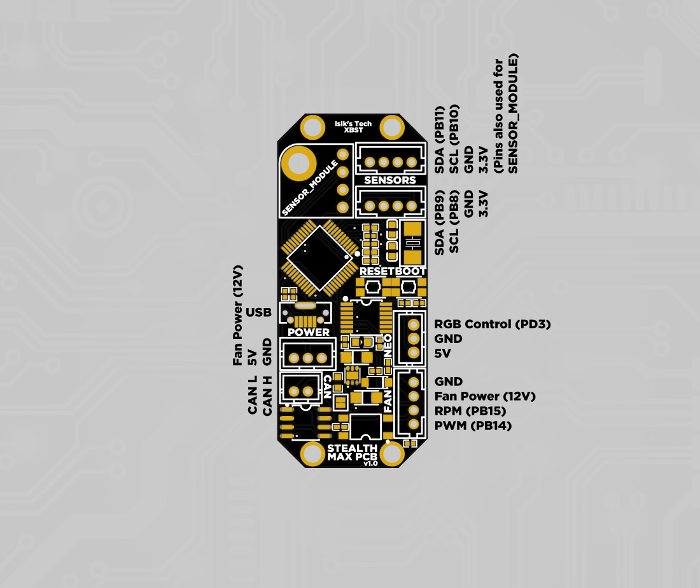

# Nevermore Stealthmax PCB 2 Instructions

## Firmware Flashing

:warning: Do not skip steps 1-6 if you sourced your PCB from anywhere but Isik's Tech. If you do and this setting wasn't pre-applied by the vendor you purchased from, you won't be able to reflash firmware after the initial flash.

1. SSH into your Raspberry Pi.
2. Download the STM32G0 legacy nBOOT_SEL setting file from [its repo](https://github.com/olikraus/stm32g031/tree/main/enable_boot0).  `sudo wget https://raw.githubusercontent.com/olikraus/stm32g031/main/enable_boot0/enable_boot0.hex`
3. Convert the hex file you downloaded to binary. `objcopy --input-target=ihex --output-target=binary enable_boot0.hex enable_boot0.bin`
4. Connect your Nevermore StealthMax PCB to your Raspberry Pi while holding down the `BOOT` button.
5. Use `lsusb` to make sure you can see the device in DFU mode.
6. Flash the binary file to enable legacy nBOOT_SEL mode. `sudo dfu-util -a 0 -d 0483:df11 --dfuse-address 0x08000000:leave -D enable_boot0.bin`
7. Hold down the `BOOT` button on your PCB. While holding it down, press `RESET`, then release `BOOT`. Alternatively, you can unplug the PCB then plug it in again while holding down the `BOOT` button. Use `lsusb` again to make sure you can see the device in DFU mode
8. Go to the Klipper directory. `cd klipper`
9. Clean remaining files from previous build. `make clean`
10. Choose the options for the build. `make menuconfig` Use the following options:

<details>
  <summary>For USB Serial Communication</summary>

```
[*] Enable extra low-level configuration options
    Micro-controller Architecture (STMicroelectronics STM32)  --->
    Processor model (STM32G0B1)  --->
    Bootloader offset (No bootloader)  --->
    Clock Reference (8 MHz crystal)  --->
    Communication interface (USB (on PA11/PA12))  --->
    USB ids  --->
()  GPIO pins to set at micro-controller startup
```

</details>
<details>
  <summary>For CAN Bus Communication WITHOUT Katapult</summary>

```
[*] Enable extra low-level configuration options
    Micro-controller Architecture (STMicroelectronics STM32)  --->
    Processor model (STM32G0B1)  --->
    Bootloader offset (No bootloader)  --->
    Clock Reference (8 MHz crystal)  --->
    Communication interface (CAN bus (on PB0/PB1))  --->
(1000000) CAN bus speed
()  GPIO pins to set at micro-controller startup
```

</details>
<details>
  <summary>For CAN Bus Communication WITH Katapult</summary>

```
[*] Enable extra low-level configuration options
    Micro-controller Architecture (STMicroelectronics STM32)  --->
    Processor model (STM32G0B1)  --->
    Bootloader offset (8KiB Bootloader)  --->
    Clock Reference (8 MHz crystal)  --->
    Communication interface (CAN bus (on PB0/PB1))  --->
(1000000) CAN bus speed
()  GPIO pins to set at micro-controller startup
```

</details>

Press `Q` then `Y` to save and quit the menu.

11. Build. `make`
12. Flash the firmware. 
<details>
  <summary>For USB Serial Communication</summary>
  
  1. Flash Klipper. `make flash FLASH_DEVICE=0483:df11`
  2. When finished, press the `RESET` button on your Nevermore StealthMax PCB.
  3. Use  `ls /dev/serial/by-id/*` to find the path startting with `/dev/serial/by-id/usb-Klipper_stm32g0b1`. This is the serial path of your Nevermore StealthMax PCB.
  
</details>
<details>
  <summary>For CAN Bus Communication WITHOUT Katapult</summary>
  
  1. Flash Klipper. `make flash FLASH_DEVICE=0483:df11`
  2. When finished, press the `RESET` button on your Nevermore StealthMax PCB.
  3. Use  `~/klippy-env/bin/python ~/klipper/scripts/canbus_query.py can0` to find the CAN bus UUID of your Nevermore StealthMax PCB.

</details>
<details>
  <summary>For CAN Bus Communication WITH Katapult</summary>

  1. Install/Build Katapult using the [instructions](https://github.com/Arksine/katapult) on its repo. Use these settings to build Katapult:
    
  ```
    Micro-controller Architecture (STMicroelectronics STM32)  --->
    Processor model (STM32G0B1)  --->
    Build Katapult deployment application (Do not build)  --->
    Clock Reference (8 MHz crystal)  --->
    Communication interface (CAN bus (on PB0/PB1))  --->
    Application start offset (8KiB offset)  --->
(1000000) CAN bus speed
()  GPIO pins to set on bootloader entry
[*] Support bootloader entry on rapid double click of reset button
[ ] Enable bootloader entry on button (or gpio) state
[*] Enable Status LED
(PA13)  Status LED GPIO Pin
  ```
2. Flash Katapult. `sudo dfu-util -a 0 -d 0483:df11 --dfuse-address 0x08000000:leave -D out/canboot.bin`
3. When finished, press the `RESET` button on your Nevermore StealthMax PCB.
4. Use  `~/klippy-env/bin/python ~/klipper/scripts/canbus_query.py can0` to find the CAN bus UUID of your Nevermore StealthMax PCB.
5. Flash Klipper. Replace `<UUID>` with your PCB's UUID. `cd ~/katapult/scripts && python3 flashtool.py -i can0 -f ~/klipper/out/klipper.bin -u <uuid>`
6. When finished, press the `RESET` button on your Nevermore StealthMax PCB.

</details>

13. While you're SSH'd in, also download the python code needed for the SGP40 sensors from the [Nevermore Max repo](https://github.com/nevermore3d/Nevermore_Max).
```
sudo wget https://raw.githubusercontent.com/nevermore3d/Nevermore_master/Software/Klipper/sgp40.py -P ~/klipper/klippy/extras
sudo wget https://raw.githubusercontent.com/nevermore3d/Nevermore_master/Software/Klipper/voc_algorithm.py -P ~/klipper/klippy/extras
sudo service klipper restart
```
14. Run this command if you are using Mainsail and want the SGP40s displayed on the dashboard:
```
cd ~/mainsail/ && grep -l additionalSensors * -R | xargs sed -i 's+additionalSensors=\[+additionalSensors=\["sgp40",+g'
```

## PCB Mount & Wiring
1. Mount the PCB where the Raspberry Pi Pico normally mounts with M2 screws.
2. All connectors except USB are JST-PH. Use the diagram below to wire your fans/sensors/CAN/power.


## Klipper Config
1. Download the [Klipper config](../Firmware/Max.cfg), and upload it to your printer.
2. Open the file and edit according to your setup.
3. Add `[include max.cfg]` in your `printer.cfg`.
