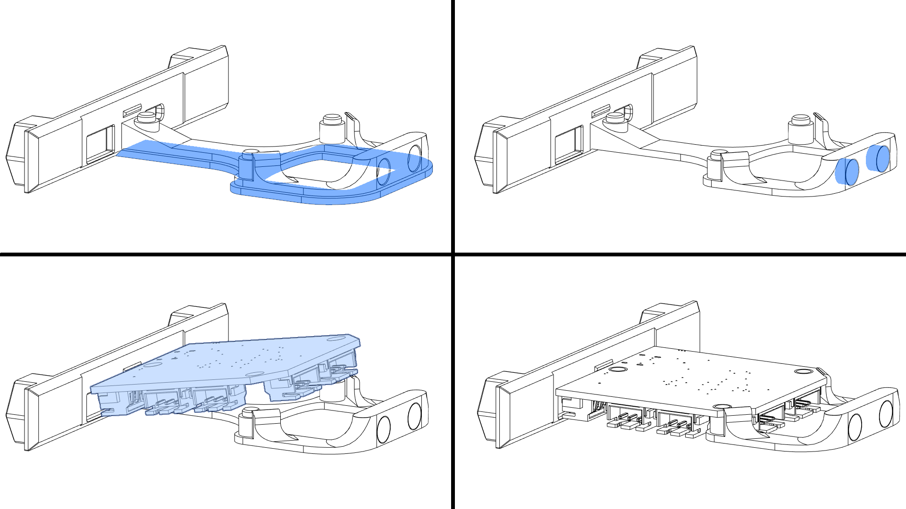
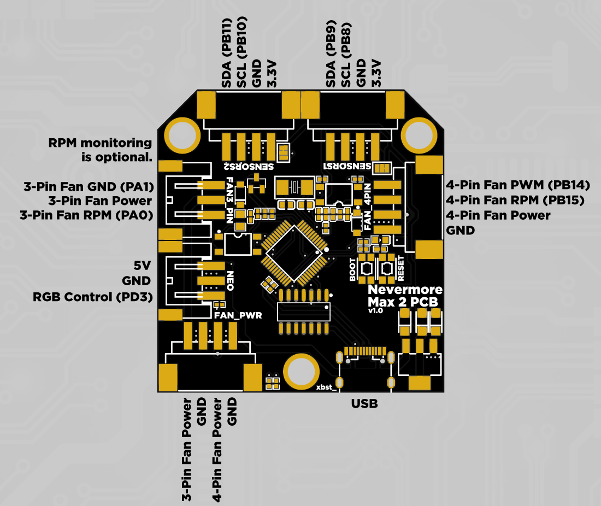

# Nevermore Max & StealthMax PCBs
~~[YouTube Video](.)~~ soon

<br>PCBs for Nevermore Max and StealthMax air filters. 
<br>More information about the Nevermore Max air filter can be found [here](https://github.com/nevermore3d/Nevermore_Max), more information about the Nevermore StealthMax air filter can be found [here](https://github.com/nevermore3d/StealthMax).
### Features
||Nevermore Max PCB|Nevermore StealthMax PCB|
|---|---|---|
|MCU|STM32F072 MCU|STM32F072 MCU|
|Fans|1x 4-pin, 1x 3/2-pin|1x4-pin|
|Sensors|2x HW I2C connectors|2x HW I2C connectors|
|Neopixels|1x Neopixel connector|-|
|CAN Bus|-|CAN transceiver|
|USB|USB C|USB micro B|

Stealthmax PCB is still in development and subject to changes/cancellation.

## Purchasing a PCB
- Isik's Tech (Me) on Etsy (US): [Max](.) ~~[StealthMax](.)~~

This project is licensed under [GPL v3](./LICENSE), meaning vendors are allowed to sell PCBs without paying me. If you'd like to support the development of this and future projects please consider [sponsoring](https://github.com/sponsors/xbst) me on GitHub. You can also subscribe on [Patreon](https://l.isiks.tech/patreon) or [YouTube](https://l.isiks.tech/member).

You can also use the included gerber files to order your own from a PCB manufacturer like [PCBWay](https://www.pcbway.com/setinvite.aspx?inviteid=374841) or [JLCPCB](https://jlcpcb.com/).
<br>

## Instructions
### 1. PCB Mount
<details>
  <summary>Nevermore Max PCB</summary>
  
  1. Print the ~~bottle opener~~ [Nevermore Max PCB tray](./Mounts/Nevermore-Max-PCB-Tray.stl) using the standard Voron print settings.
  2. Remove the built-in supports.
  3. Superglue 2 magnets. Pay attention to the polarities.
  4. Mount the PCB. The plastic latches will keep the PCB in place, no screws needed. The USB/power side should be seated first.
     
  
</details>
<details>
  <summary>Nevermore StealthMax PCB</summary>
  
  1. Mount the PCB where the Raspberry Pi Pico normally mounts with M2 screws.
</details>

### 2. Wiring
<details>
<summary>Nevermore Max PCB</summary>
 
  1. All connectors except USB are JST-XH. Use the diagram below to wire your fans/sensors/leds/power.

  
</details>
<details>
  <summary>Nevermore StealthMax PCB</summary>

  1. All connectors except USB are JST-XH. Use the diagram below to wire your fans/sensors/CAN/power.

  
</details>
  
### 3. Building Klipper
1. SSH into your Raspberry Pi.
2. Edit the `stm32f0_i2c.c` file to enable the second I2C bus on the MCU.
```
sudo nano klipper/src/stm32/stm32f0_i2c.c
```
3. Below `DECL_CONSTANT_STR("BUS_PINS_i2c1_PB8_PB9", "PB8,PB9");` add these 2 lines:
```
  DECL_ENUMERATION("i2c_bus", "i2c2", 0);
  DECL_CONSTANT_STR("BUS_PINS_i2c2", "PB10,PB11");
```
So the file should look like:

```
... (more stuff above)

#if CONFIG_MACH_STM32F0
  DECL_ENUMERATION("i2c_bus", "i2c1_PB6_PB7", 0);
  DECL_CONSTANT_STR("BUS_PINS_i2c1_PB6_PB7", "PB6,PB7");
  DECL_ENUMERATION("i2c_bus", "i2c1_PF1_PF0", 1);
  DECL_CONSTANT_STR("BUS_PINS_i2c1_PF1_PF0", "PF1,PF0");
  DECL_ENUMERATION("i2c_bus", "i2c1_PB8_PB9", 2);
  DECL_CONSTANT_STR("BUS_PINS_i2c1_PB8_PB9", "PB8,PB9");
  DECL_ENUMERATION("i2c_bus", "i2c2", 0);
  DECL_CONSTANT_STR("BUS_PINS_i2c2", "PB10,PB11");
  // Deprecated "i2c1a" style mappings
  DECL_ENUMERATION("i2c_bus", "i2c1", 0);
  DECL_CONSTANT_STR("BUS_PINS_i2c1", "PB6,PB7");
  DECL_ENUMERATION("i2c_bus", "i2c1a", 1);
  DECL_CONSTANT_STR("BUS_PINS_i2c1a", "PF1,PF0");

... (more stuff below)
```
4. Press `CTRL+X`, then `Y`, then `Enter` to save.
5. Go to the Klipper directory
```
cd klipper
```
6. Clean remaining files from previous build.
```
make clean
```
7. Choose the options for the build.
```
make menuconfig
```
Use the following options:
```
[*] Enable extra low-level configuration options
    Micro-controller Architecture (STMicroelectronics STM32)  --->
    Processor model (STM32F072)  --->
    Bootloader offset (No bootloader)  --->
    Clock Reference (8 MHz crystal)  --->
    Communication interface (USB (on PA11/PA12))  --->
    USB ids  --->
()  GPIO pins to set at micro-controller startup
```
Press `Q` then `Y` to save and quit the menu.

8. Build.
```
make
```
9. While you're SSH'd in, also download the python code needed for the SGP40 sensors from the Nevermore Max repo:
```
cd ~/klipper/klippy/extras
sudo wget https://raw.githubusercontent.com/nevermore3d/Nevermore_Max/master/Software/Klipper/voc_algorithm.py
sudo wget https://raw.githubusercontent.com/nevermore3d/Nevermore_Max/master/Software/Klipper/sgp40.py
```
### 4. Flashing Klipper


### 5. Klipper Config


## YouTube

I am a YouTube content creator, and these projects were designed for my videos. If you want content about these projects & more, please consider [subscribing to my YouTube channel](https://www.youtube.com/channel/UClAWYmCkHjsbaX9Wz1df2mg).
<br>

If you feel like contributing to the development of this project and other projects like this you can sponsor me on [GitHub](https://github.com/sponsors/xbst), subscribe on [Patreon](https://l.isiks.tech/patreon) or [YouTube](https://l.isiks.tech/member).

## Notes
- This readme file contains affiliate links. I make a comission on qualifying purchases.
- This project does not come with any warranty, if you choose to build/use a Nevermore PCB, you are doing this at your own risk!
- If you want to sell PCBs, you are allowed to, and you will not owe me any royalties. **You cannot claim that I endorse the sale**. You can check the license file for more information. However, if you **wish** to give me a share you can sponsor me on [GitHub](https://github.com/sponsors/xbst), subscribe on [Patreon](https://l.isiks.tech/patreon) or [YouTube](https://l.isiks.tech/member).
